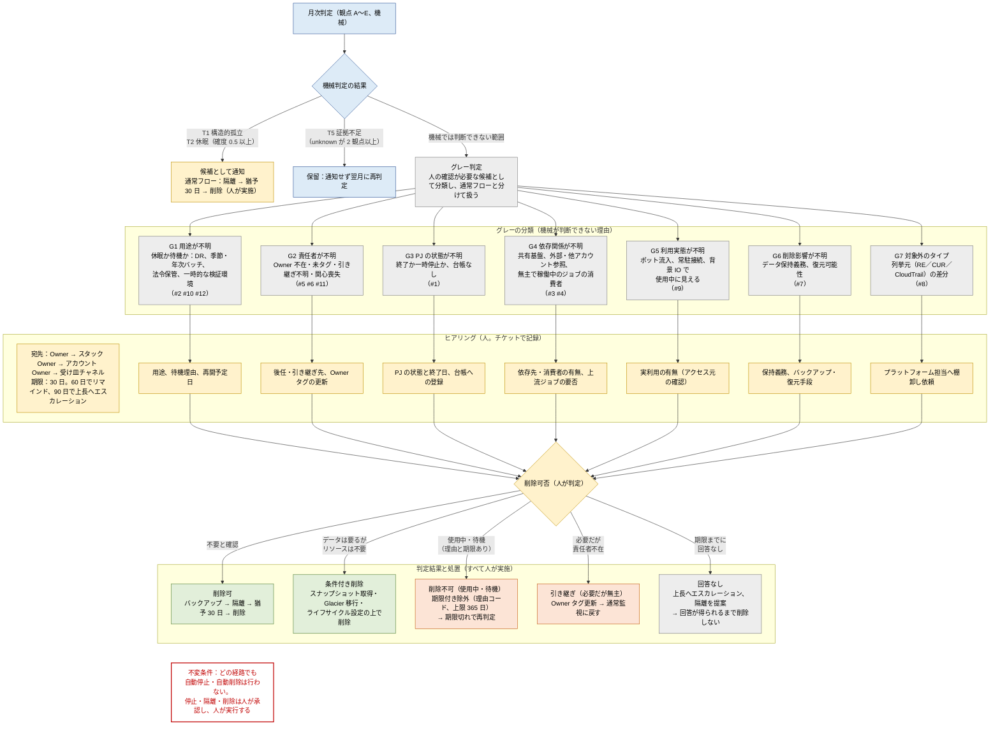

# 機械的に判断できない範囲の扱い：グレー判定 → ヒアリング → 削除可否 フロー

| 項目 | 内容 |
|---|---|
| 版 | 0.1（2026-09-24） |
| 位置づけ | 調査結果まとめ §3「機械的に判定できない範囲」の 12 事象を、処置の流れとして整理したもの。図中の #1〜#12 は §3 の番号 |
| 不変条件 | どの経路でも自動停止・自動削除は行わない。停止・隔離・削除は人が承認し、人が実行する |

画像：`aws_orphan_gray_zone_flow.png`（PNG）／`aws_orphan_gray_zone_flow.svg`（SVG）

## 1. フロー図

## 2. グレーの分類と対応表

| 分類 | 機械が判断できない理由（§3 の事象） | ヒアリング先 | 聞くこと | 想定される回答 → 判定結果 |
|---|---|---|---|---|
| G1 用途が不明 | #2 休眠と待機の区別（DR、季節・年次バッチ、法令保管）／#10 年次バッチ／#12 一時的にアイドルな正当リソース | Owner（不在ならスタック → アカウント Owner） | 用途、待機の理由、再開予定日、保持期限 | 「不要」→ 削除可／「待機中で再開日あり」→ 期限付き除外（SEASONAL／DR_STANDBY 等）／「検証済みで不要」→ 削除可 |
| G2 責任者が不明 | #5 Owner の意味解決（後任、組織改編、委託先）／#6 関心を失った Owner／#11 タグ未付与既存リソースの Owner | 推定 Owner（作成者、スタック、アカウント）→ 受け皿チャネル | 後任・引き継ぎ先、Owner タグの更新可否 | 「引き継ぐ」→ Owner タグ更新して通常監視へ／「誰も要らない」→ 削除可／回答なし → エスカレーション |
| G3 PJ の状態が不明 | #1 PJ が本当に終了したか（台帳なし、一時停止との区別） | PJ 責任者、PMO | PJ の状態（終了／一時停止／継続）と終了日、台帳への登録 | 「終了」→ 一式を削除候補（隔離 → 猶予 → 削除）／「一時停止」→ 期限付き除外／「継続」→ Owner 更新 |
| G4 依存関係が不明 | #3 共有・基盤リソースの孤立／#4 無主だが稼働中のジョブの消費者 | プラットフォーム担当、上流ジョブの Owner | 依存先・消費者の有無、外部・他アカウント参照、上流ジョブの要否 | 「依存なし」→ 削除可／「依存あり」→ 除外（SHARED_PLATFORM、年次レビュー）／「産出物に消費者なし」→ 上流ジョブごと削除候補 |
| G5 利用実態が不明 | #9 ボット流入、常駐コネクション、OS の背景 IO | Owner、アプリ担当 | 実利用の有無、アクセス元（人・システム・ボット） | 「実利用なし」→ 削除可／「実利用あり」→ 通常監視へ戻し閾値を調整 |
| G6 削除影響が不明 | #7 削除可否と影響範囲（データ保持義務、復元可能性） | Owner、データ所管、法務・監査担当 | 保持義務の有無と期限、バックアップ・復元手段 | 「保持義務あり」→ 条件付き削除（スナップショット・Glacier 移行後）または除外（COMPLIANCE_HOLD）／「義務なし」→ 削除可 |
| G7 対象外のタイプ | #8 列挙元（Resource Explorer／CUR／CloudTrail）のカバレッジ外 | プラットフォーム担当 | 差分リソースの棚卸し、対応タイプ一覧の更新 | 棚卸し後に G1〜G6 のいずれかへ振り分け |

## 3. 流れの要点

- **グレー判定**：機械判定（観点 A〜E）で T1／T2 に確定せず、かつ証拠不足（T5）でもない候補を、人の確認が必要なものとして G1〜G7 に分類し、通常フローとは分けて扱う。
- **ヒアリング**：宛先は Owner → スタック Owner → アカウント Owner → 受け皿チャネルの順で解決し、チケットで記録する。期限は 30 日、60 日でリマインド、90 日で上長へエスカレーション。
- **削除可否**：回答に応じて「削除可」「条件付き削除」「削除不可（期限付き除外）」「引き継ぎ（Owner 更新）」「回答なし（エスカレーション）」の 5 つに落とす。削除に至る経路は必ず「バックアップ → 隔離 → 猶予 30 日 → 削除」を人が実施する。回答が得られないものは削除しない。
- **除外は期限付き**：除外に落ちたものは理由コードと期限（上限 365 日）を必ず持ち、期限切れで機械判定に戻る。
